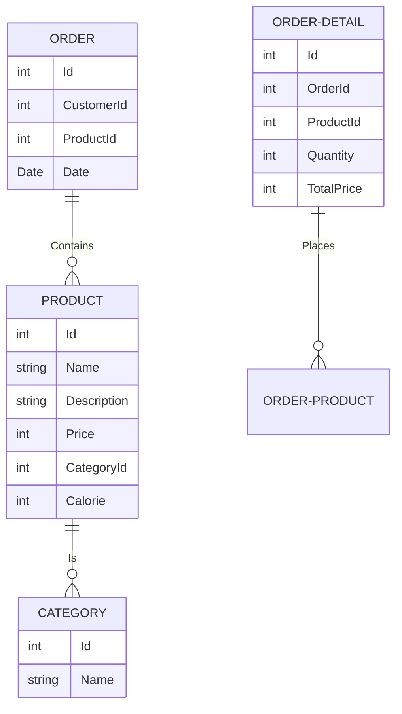

**Patisserie Desktop App**

**- First**

Administrators will be able to log in as Administrator and enter data through the interface, check and delete the entered data.
Customers will be able to view the data entered by administrators and access the purchasing process in the same way.

With this Short-Scale project, Patisserie managers will be able to manage their workplaces with a simple interface. In this way, they will be able to run a much more successful business.

Here is a simple flow chart:

  Database Schema to Follow      

